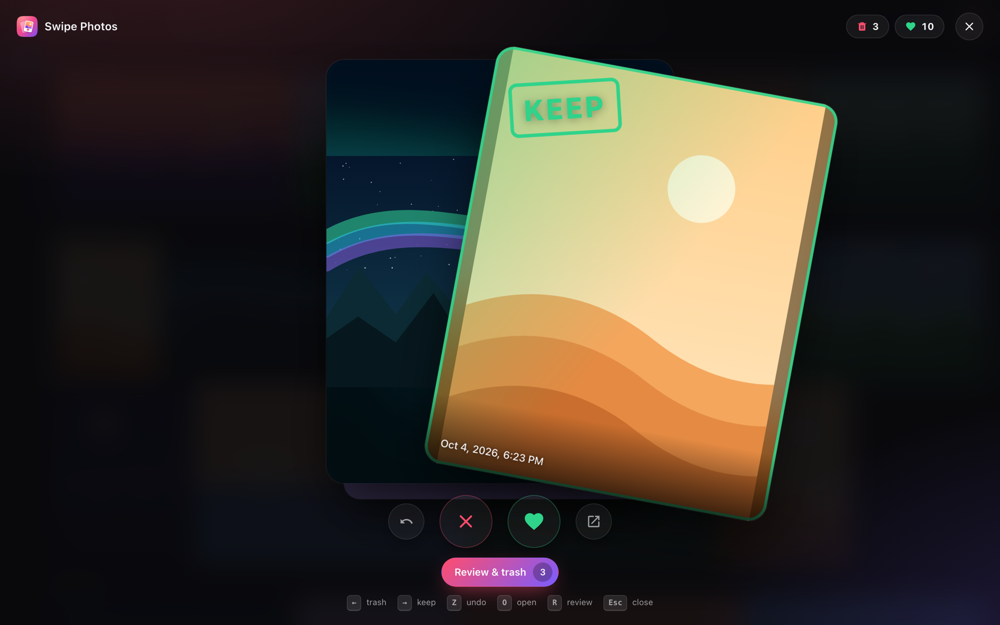
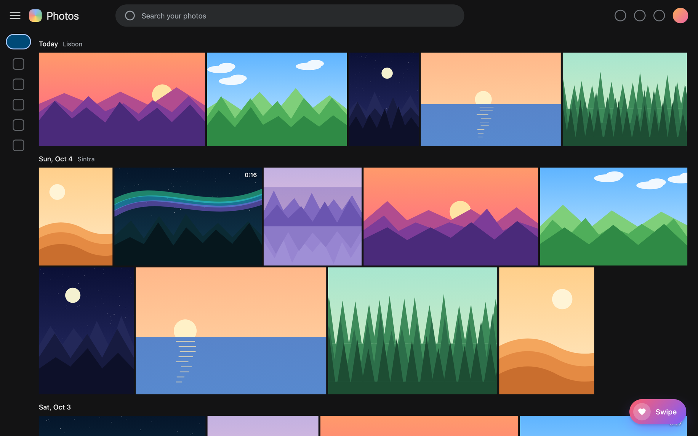
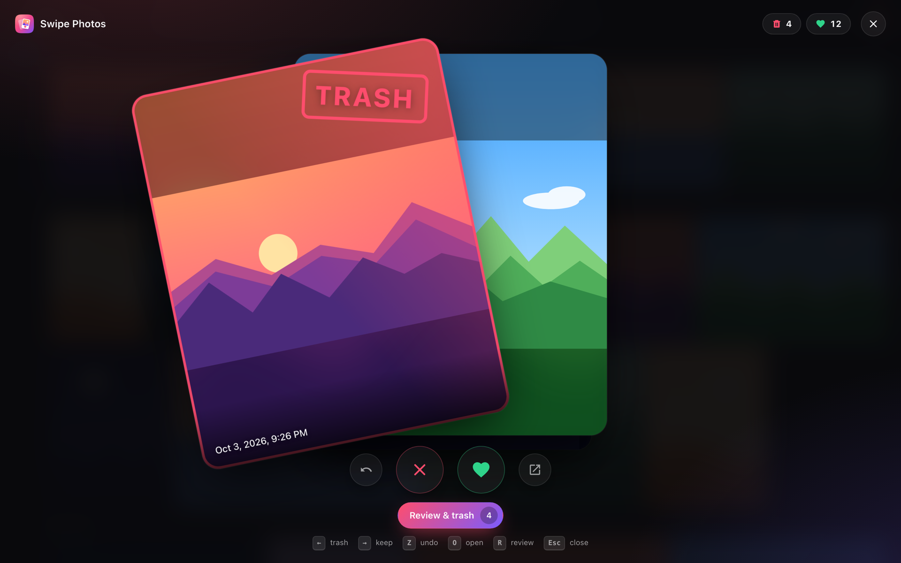
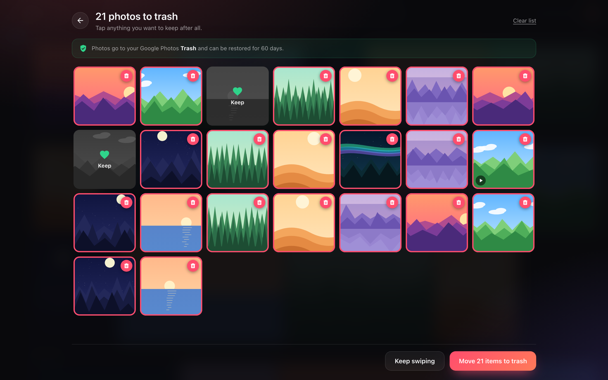
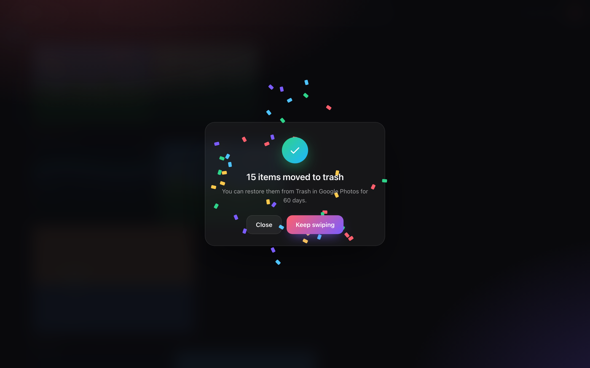
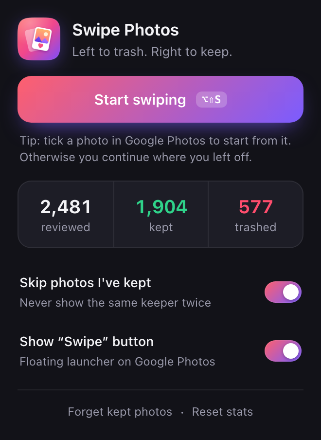

# Swipe Photos

Swipe to clean up Google Photos: **swipe left to trash, right to keep.**



## What it looks like

A **Swipe** button appears on Google Photos. Click it, or press **Alt+Shift+S**, to start.



Drag a photo left to mark it for the trash, or right to keep it. You can also use a two-finger trackpad swipe or the arrow keys.



Nothing is deleted while you swipe. When you're ready, **Review & trash** shows everything you marked. Tap a photo to change your mind.



Confirming moves them to Google Photos **Trash**, where you can still restore them for 60 days.



The toolbar popup shows your stats and settings.



<sub>Screenshots show the real extension running on a demo photo library.</sub>

## Install

**Chrome Web Store:** _coming soon_

### Developer mode

1. Open `chrome://extensions` and switch on **Developer mode** (top right).
2. Click **Load unpacked** and pick this repository folder.
3. Open [photos.google.com](https://photos.google.com) and click the **Swipe** button (bottom right), the toolbar icon, or press **Alt+Shift+S**.

## How it works

- **Choosing where to start:** tick a photo in Google Photos and then open Swipe to start from that photo. If you scrolled the grid to some date, it starts at the first photo on screen. If the grid is at the top, it continues after the last photo you kept, with a **Start from top** button in case you want to begin again.
- Photos you swipe left go on a **trash list**. Nothing is deleted until you open **Review & trash** and confirm.
- In review, tap any photo to keep it after all. Confirming selects the photos in Google Photos and moves them to **Trash**, where you can restore them for 60 days.
- Photos you keep are remembered (per Google account) and skipped next time. You can turn this off in the popup.
- Your trash list survives closing the tab.

| Action | Mouse / trackpad | Keyboard |
| --- | --- | --- |
| Trash | drag or two-finger swipe left, ✕ button | `←` / `A` |
| Keep | drag or two-finger swipe right, ♥ button | `→` / `D` |
| Undo | ↺ button | `Z` / `Backspace` / `⌘Z` |
| Open in Google Photos (play videos) | ↗ button | `O` / `↑` |
| Review & trash | bottom button | `R` / `Enter` |
| Close | ✕ top right | `Esc` |

## Project layout

```
manifest.json
background.js           keyboard shortcut → active tab
content/photos-dom.js   all Google Photos DOM access (scan grid, scroll, select, trash)
content/swipe-ui.js     the swipe app: state, persistence, overlay UI (shadow DOM)
content/content.js      bootstrap: floating button, messages, auto-start
content/swipe.css       overlay + launcher styles
popup/                  toolbar popup: start, stats, settings
```

If Google changes its markup, `content/photos-dom.js` is the only file that should need fixing.

## Privacy

Everything stays in your browser: no servers, no analytics, no ads. The extension only runs on photos.google.com and stores its data in `chrome.storage.local`. See [PRIVACY.md](PRIVACY.md).

## License

[The Lagom License](LICENSE) (v2): use, change and share it freely; just keep the copyright line and the license with it. Swipe Photos is not affiliated with or endorsed by Google. Google Photos is a trademark of Google LLC.
